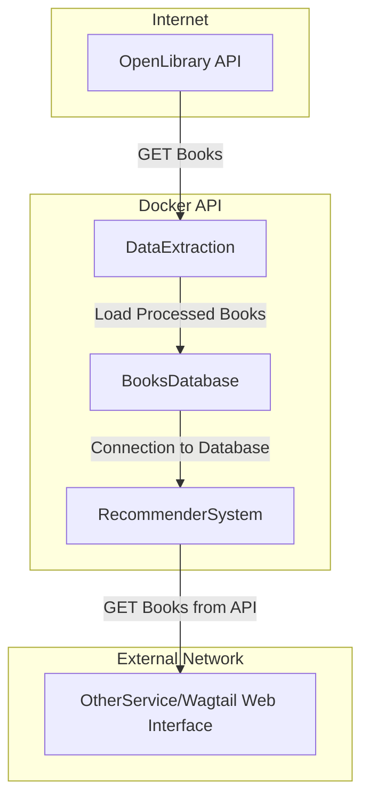
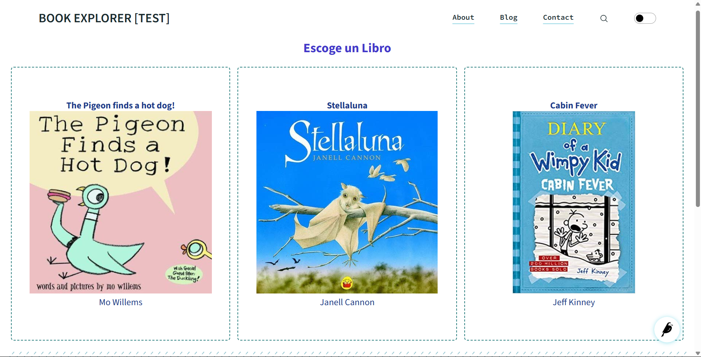
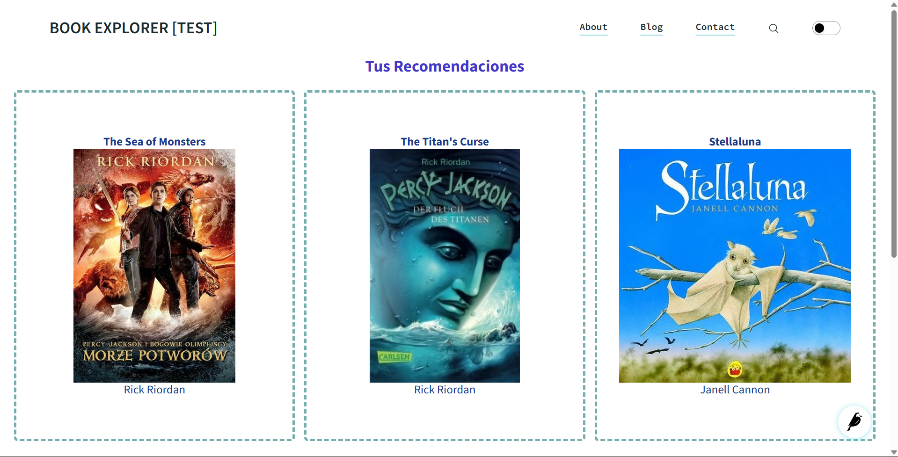

# BookExplorer
 
## Abstract
Recommendation system based on user preferences to explore new titles using similarities between books.

## Author and Contact
Alexis Aguilar [Student of Bachelor's Degree in "Tecnologías para la Información en Ciencias" at Universidad Nacional Autónoma de México [UNAM](https://www.unam.mx/)]: alexis.uaguilaru@gmail.com

Project developed for the subject "Distributed Computing" for the class taught in semester 2025-2.

## License
Project under [MIT License](LICENSE)

## Introduction
As there is an enormous amount of titles, it becomes overwhelming how to find new books that fit a preference or previously read books. Therefore, this project, whose product is to create a microservice, aims to create a solution to explore new titles based on the user's preferences and previous books.

For capturing these preferences and previous readings (titles read), what is done is to show the user three different books to choose from, avoiding overloading the user with information and details of the books.

## Justification
The development of this project solves a constant problem among readers, which is the question of which book to read. Therefore, giving different book options to the users could facilitate the resolution of the next reading for each reader. Because of the latter, it becomes the main reason for the development of this solution making use of the reader's own preferences.

## General Aim
Develop a book recommendation system that is intuitive and simple to use for the user, with which suggestions are adjusted based on their preferences, specifically, by the books whose covers and titles caught their attention. In order to create an alternative solution to the question of what to read by simulating going to a bookstore and choosing a book only by reading its title and seeing its cover.

## Particular Aims
- Making book recommendations that allow users to explore new genres and titles based on their selections and preferences.
- Making use of technologies such as containers (Docker), APIs and Machine Learning to develop the book recommender.
- Service the recommender system through a web interface with the user, deployed on a server hosted in the cloud.

## Methodology
The Extreme Programming (XP) methodology was used for this project, with development cycles of 1 to 2 weeks. The progress tracking of this methodology is found in the closed issues and pull requests labeled with the code of each activity and cycle found in the project's [Jira](https://alexisuaguilaru.atlassian.net/jira/software/projects/SCRUM/boards/1/timeline?epic=COMPLETE6M&atlOrigin=eyJpIjoiZGEwZmQzZmY5NmVmNDk2Y2JkM2YyMjM1M2U4MDA0YjEiLCJwIjoiaiJ9).

First, the books obtained through the [OpenLibrary API](https://openlibrary.org/developers) were processed, from which only the fields of interest for the project (author, title, ISBN, genres, place and date of publication, publisher) were stored. The processed books were stored in MongoDB, to later represent the genres of each book in a numerical vector using [TF-IDF](https://scikit-learn.org/stable/modules/generated/sklearn.feature_extraction.text.TfidfVectorizer.html#sklearn.feature_extraction.text.TfidfVectorizer), which were used to determine the similarity between books; the latter being the basis of the books that are recommended through this service.

Having the similar books of a book, Flask is used to create an API that allows, by means of GET requests, to obtain the information of a book as well as the suggestions or recommendations of other books. This API communicates with the web interface, built with [Wagtail](https://wagtail.org/get-started/), to generate the interaction with the user.

## Installation Instructions
The following procedure is to execute a basic example of the operation of the microservice without serving to the Internet. To perform an execution or deploy refer to [Usage Manual](./Documentation/UsageManual.pdf) 

First it is necessary to clone this repository:
```bash
git clone https://github.com/alexisuaguilaru/BookExplorer.git
```

Then, it is necessary to create a network with the next command:
```bash
docker network create books_explorer_internal
```

Next, build and run the multi-container for the different microservices for the service using:
```bash
make deploy
```
In case it has been done previously, use:
```bash
make deploy_restart
```

Finally, to generate random recommendations with the API, go to:
```bash
http://127.0.0.1:8013/recommendations
```
Or go to:
```bash
http://localhost:8013/recommendations
```

For stopping the service, use:
```bash
make down
```

## Usage Instructions
In order to make use of the API, two types of GET requests can be generated, either to obtain recommendations or to obtain information about an available book, using the following requests:
* Obtain book recommendations or suggestions. Where ISBN_CODE can be empty '' to obtain random recommendations or be a valid ISBN code or one that exists in the database:
```bash
GET http://localhost:8013/recommendations?isbn=ISBN_CODE
``` 
* Obtain the information of a book. Where ISBN_CODE must be a valid ISBN code or exist in the database.:
```bash
GET http://localhost:8013/information_book?isbn=ISBN_CODE
```

## Technologies
* APIs
* [Python 3.12.5](https://www.python.org/)
  * [Flask](https://flask.palletsprojects.com/en/stable/)
  * [Scikit Learn](https://scikit-learn.org/stable/)
  * [Pytest](https://docs.pytest.org/en/stable/)
* [MongoDB](https://www.mongodb.com/)
* [Docker](https://www.docker.com/)
* [AWS](https://aws.amazon.com/)
  * EC2 Instances for testing

## Architecture (Dataflow) Diagram


## Results 
The following screenshots show the operation of the API displayed in the Wagtail web interface.

* Books that the user can choose to explore new titles:


* Books that are suggested to the user after exploring new titles:


## Conclusions
Initially this project was planned to be done with [Django](https://www.djangoproject.com/), but as the ideas around the project were refined, it was realized that it was not going to take full advantage of the functionality it offers; therefore it was decided to use [Flask](https://flask.palletsprojects.com/en/stable/) for the creation of this microservice or API. In addition, the final objective of this project is to create an API to be used in other larger projects (such as the web interface and continuation of this project), this is facilitated by using Flask, which has a simpler interface and functionalities but equally robust as those offered by Django for the creation of APIs.

Similarly, it was planned to use Flask to create the web interface but for simplicity reasons and to take better advantage of Django's functionalities, it was decided to discard the implementation of the web interface with Flask for Django. That is, as the latter has all the implementations and modules necessary for the creation of a web service, it becomes more preferable for it to be the one that consumes the API created in Flask and formats the response as shown in [Results](#results). 